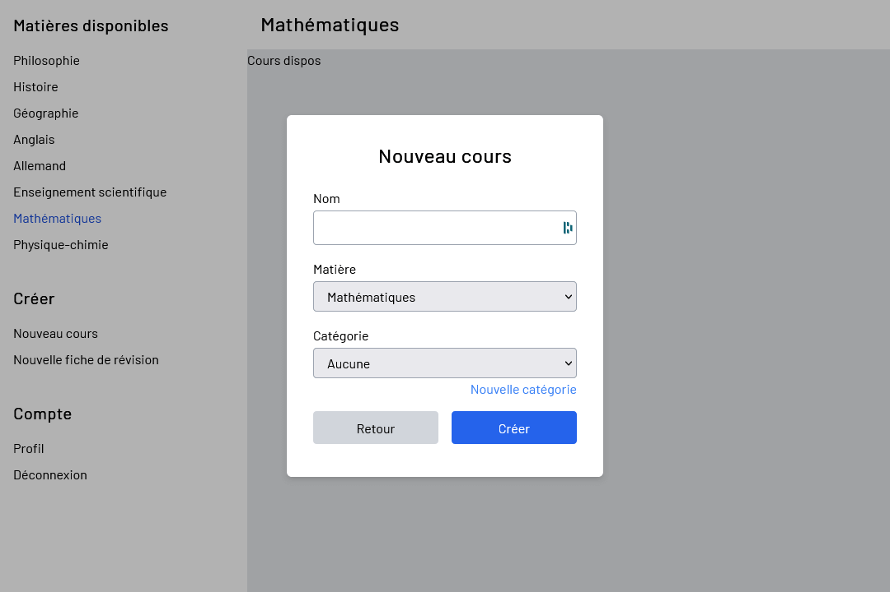

# Courselib

Ce projet avait pour but de créer un hub afin de partager les cours entre élèves.
L'idée était que chacun puisse poster ses cours et proposer des modifications sur ceux des autres.

Le frontend est déployé sur [Netlify](https://www.netlify.com/) et le backend sur [Firebase](https://firebase.google.com/).

Par manque de temps et complexité du projet, il a été abandonné.
Seules la connexion / inscription et la page d'accueil sont fonctionnelles.

